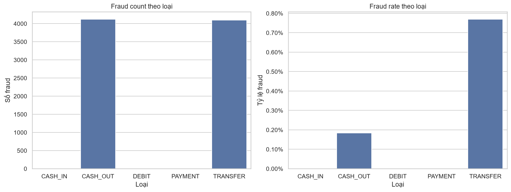
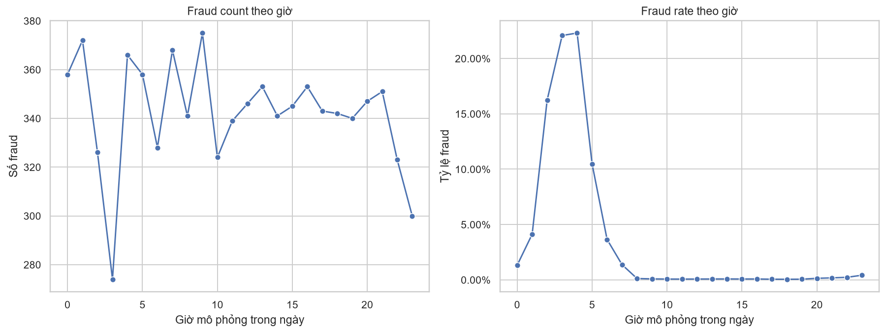
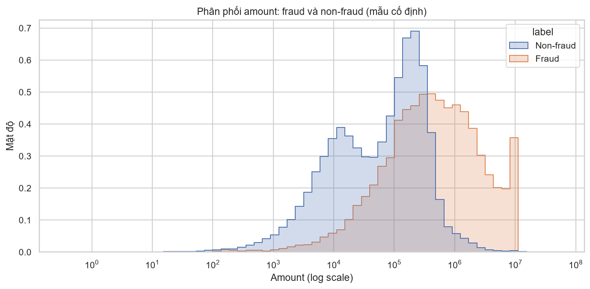
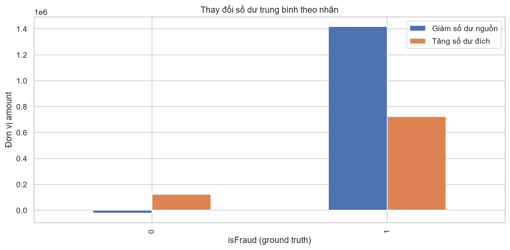

# Khảo sát và phân tích dữ liệu PaySim – EDA-01

**Nguồn:** `PS_20174392719_1491204439457_log.csv`

**Ngày chạy:** 2026-08-12

**Thực hiện:** Khải; **kiểm chứng/phụ trách hạng mục:** Châm

**Phương pháp:** đọc toàn bộ CSV theo chunk 200.000 dòng; ground truth là `isFraud`.

## 1. Tổng quan và chất lượng dữ liệu

| Chỉ số | Kết quả đã kiểm chứng |
|---|---:|
| Số dòng / số cột | 6.362.620 / 11 |
| Null | 0 |
| Step | 1–743 (31 ngày mô phỏng) |
| Tổng amount | 1.144.392.944.759,77 |
| Fraud count | 8.213 |
| Fraud rate | 0,129% |
| `isFlaggedFraud = 1` | 16 |
| Duplicate hoàn toàn / nhóm duplicate | 0 / 0 |
| Dòng có balance âm | 0 |
| Mismatch số dư nguồn / đích | 5.000.754 / 3.823.898 |

Không loại dữ liệu vì balance mismatch. PaySim là dữ liệu mô phỏng; số dư có thể không phản ánh một phép ghi sổ khép kín ở từng dòng. ETL nên giữ bản ghi gốc, lưu cờ chất lượng và các chênh lệch dẫn xuất để phân tích.

## 2. Theo loại giao dịch

| Type | Transaction count | Fraud count | Fraud rate trong type |
|---|---:|---:|---:|
| CASH_IN | 1.399.284 | 0 | 0,000% |
| CASH_OUT | 2.237.500 | 4.116 | 0,184% |
| DEBIT | 41.432 | 0 | 0,000% |
| PAYMENT | 2.151.495 | 0 | 0,000% |
| TRANSFER | 532.909 | 4.097 | 0,769% |

Fraud chỉ xuất hiện ở `TRANSFER` và `CASH_OUT`. `CASH_OUT` có fraud count cao hơn một chút, nhưng `TRANSFER` có fraud rate cao hơn; hai khái niệm không được dùng thay thế nhau.

## 3. Theo thời gian

- Giờ có fraud count cao nhất: **9h**.
- Giờ có fraud rate cao nhất: **4h**.
- Ngày có fraud count cao nhất: **ngày 17**.
- Ngày có fraud rate cao nhất: **ngày 31**; ngày này chỉ có 272 giao dịch và tất cả là fraud, nên không nên kết luận rủi ro chỉ từ rate mà không hiển thị transaction count.

## 4. Theo amount

| Amount band | Transaction count | Fraud count | Fraud rate |
|---|---:|---:|---:|
| XS | 142.642 | 58 | 0,041% |
| S | 1.143.361 | 220 | 0,019% |
| M | 2.239.253 | 1.429 | 0,064% |
| L | 2.706.738 | 3.800 | 0,140% |
| XL | 124.976 | 2.419 | 1,936% |
| XXL | 5.650 | 287 | 5,080% |

- Tổng amount fraud: **12.056.415.427,84**, chiếm **1,054%** tổng amount.
- XXL có fraud rate cao nhất, trong khi L có fraud count cao nhất. Dashboard phải trình bày đồng thời count, rate và mẫu số.

## 5. Theo tài khoản

- `nameOrig` phân biệt: **6.353.307**; `nameDest` phân biệt: **2.722.362**.
- Toàn bộ 6.362.620 tài khoản nguồn mang prefix C; merchant không xuất hiện ở nguồn.
- Ở đích: C = 4.211.125, M = 2.151.495; merchant chỉ xuất hiện ở đích.
- Tài khoản nguồn xuất hiện nhiều nhất có 3 giao dịch; tài khoản đích đứng đầu là `C1286084959` với 113 giao dịch.
- Mỗi nguồn fraud chỉ xuất hiện một lần; nhóm đích fraud cao nhất có 2 giao dịch fraud.
- Fraud có `oldbalanceDest = 0`: **5.351/8.213 (65,153%)**. Đây là dấu hiệu đáng chú ý, chưa phải bằng chứng tài khoản mule nếu chưa có dữ liệu bổ sung.

## 6. Theo balance

- Full-drain (`abs(oldbalanceOrg - amount) < 0,01` và `newbalanceOrig = 0`): **8.024/8.213 (97,699%)** fraud.
- `BalanceDropOrig = oldbalanceOrg - newbalanceOrig` và `BalanceChangeDest = newbalanceDest - oldbalanceDest` là trường dẫn xuất độc lập với nhãn; `isFraud` không được dùng làm đầu vào tạo feature.
- Full-drain và `oldbalanceDest = 0` là các dấu hiệu đáng chú ý; chưa gọi là feature “mạnh nhất” khi chưa có phép đo so sánh trên mô hình/validation.

## 7. Ảnh hưởng triển khai

- **Data Warehouse:** lưu `HourOfDay`, `StepDay`, `AmountBand`, `AccountType`, `BalanceDropOrig`, `BalanceChangeDest`, `IsHighRiskType`; giữ nguyên balance gốc và cờ mismatch.
- **ETL:** kiểm tra schema/domain/null/amount âm/account format; không loại bản ghi chỉ vì mismatch; reconciliation phải giữ đủ 6.362.620 dòng.
- **ML:** chỉ dùng `isFraud` làm nhãn; `isFlaggedFraud` là thuộc tính nguồn; đánh giá feature bằng validation thay vì suy diễn từ EDA.
- **Dashboard:** luôn hiển thị fraud count, fraud rate và transaction count; cảnh báo nhóm có mẫu số nhỏ.
