# ERD — PaySim Fraud Detection Data Mart

**Loại:** Physical Data Model (Kimball Star Schema)
**Database:** FraudDW (SQL Server 2019+)
**Cập nhật:** 2026-08-11
**Nguồn:** Toàn bộ SQL scripts `00` → `08`

---

## Sơ đồ ERD

```mermaid
erDiagram
    TRANSACTION_RAW {
        int BatchID PK "ID lô ETL"
        int RowNumberInChunk PK "Số thứ tự dòng trong chunk (PK composite)"
        string SourceFileName "Tên file CSV nguồn"
        int StepRaw "Bước mô phỏng gốc (1-744)"
        string TypeCode "Loại giao dịch thô"
        decimal Amount "Số tiền giao dịch"
        string NameOrig "Tài khoản nguồn"
        decimal OldBalanceOrg "Số dư trước (nguồn)"
        decimal NewBalanceOrig "Số dư sau (nguồn)"
        string NameDest "Tài khoản đích"
        decimal OldBalanceDest "Số dư trước (đích)"
        decimal NewBalanceDest "Số dư sau (đích)"
        int IsFraud "Nhãn gian lận gốc PaySim (0/1)"
        int IsFlaggedFraud "Cờ gian lận PaySim (0/1)"
        datetime LoadedAt "Thời điểm nạp vào staging"
    }

    DIM_DATE {
        int DateKey PK "Surrogate key định dạng YYYYMMDD"
        int StepDay "Ngày mô phỏng (1-31) UNIQUE"
        string DayOfWeek "Thứ trong tuần (Monday...Sunday)"
        int DayOfWeekNum "Số thứ tự thứ (1=T2, 7=CN)"
        int WeekOfSimulation "Tuần mô phỏng (1-5)"
        boolean IsWeekend "1 nếu là cuối tuần"
    }

    DIM_TIME {
        int TimeKey PK "Giờ trong ngày (0-23)"
        int HourOfDay "Giờ (0-23)"
        string TimeSlot "NIGHT/MORNING/AFTERNOON/EVENING/LATE_NIGHT"
        boolean IsPeakHour "1 nếu giờ cao điểm (8-11 và 12-17)"
    }

    DIM_TRANSACTION_TYPE {
        int TransactionTypeKey PK "Surrogate key"
        string TypeCode "CASH_IN/CASH_OUT/DEBIT/PAYMENT/TRANSFER UNIQUE"
        string TypeName "Tên tiếng Việt"
        boolean IsHighRiskType "1 nếu rủi ro cao (TRANSFER, CASH_OUT)"
        string Description "Mô tả nghiệp vụ"
    }

    DIM_ACCOUNT {
        int AccountKey PK "Surrogate key"
        string AccountID "Mã tài khoản gốc (nameOrig/nameDest) UNIQUE"
        string AccountType "C=Khách hàng, M=Đại lý"
    }

    DIM_AMOUNT_BAND {
        int AmountBandKey PK "Surrogate key"
        string BandCode "XS/S/M/L/XL/XXL UNIQUE"
        string BandLabel "Nhãn hiển thị (Rất nhỏ...Cực lớn)"
        decimal LowerBound "Giới hạn dưới (bao gồm)"
        decimal UpperBound "Giới hạn trên (không bao gồm), NULL cho XXL"
        decimal RiskWeight "Trọng số rủi ro (mặc định 1.0)"
    }

    DIM_RISK_POLICY {
        int RiskPolicyKey PK "Surrogate key"
        string PolicyVersion "Phiên bản policy (vd: v1.0)"
        string RiskLevel "LOW/MEDIUM/HIGH/CRITICAL"
        decimal ScoreThresholdMin "Ngưỡng fraud_score tối thiểu"
        decimal ScoreThresholdMax "Ngưỡng fraud_score tối đa"
        string RecommendedAction "ALLOW/STEP_UP_VERIFY/HOLD_AND_REVIEW/BLOCK_AND_ALERT"
        date EffectiveDate "Ngày áp dụng policy"
        boolean IsActive "1 nếu đang được áp dụng"
    }

    DIM_MODEL_VERSION {
        int ModelVersionKey PK "Surrogate key"
        string ModelName "Tên mô hình (LightGBM, RandomForest...)"
        string Version "Phiên bản (v1.0, v1.1...)"
        date TrainDate "Ngày huấn luyện"
        decimal Precision "Precision trên test set"
        decimal Recall "Recall trên test set"
        decimal F2Score "F2-Score trên test set"
        decimal PrAUC "PR-AUC trên test set"
        decimal Threshold "Ngưỡng phân loại được chọn"
        boolean IsProduction "1 nếu đang dùng trong production"
        string ModelFilePath "Đường dẫn file model (.pkl)"
    }

    FACT_TRANSACTION {
        int TransactionKey PK "Surrogate key tự tăng"
        int DateKey FK "Ngày giao dịch - DIM_DATE"
        int TimeKey FK "Giờ giao dịch - DIM_TIME"
        int TransactionTypeKey FK "Loại giao dịch - DIM_TRANSACTION_TYPE"
        int OrigAccountKey FK "Tài khoản nguồn - DIM_ACCOUNT"
        int DestAccountKey FK "Tài khoản đích - DIM_ACCOUNT"
        int AmountBandKey FK "Khoảng tiền - DIM_AMOUNT_BAND"
        int StepRaw "Bước mô phỏng gốc (1-744)"
        decimal Amount "Số tiền giao dịch"
        decimal OldBalanceOrig "Số dư trước (tài khoản nguồn)"
        decimal NewBalanceOrig "Số dư sau (tài khoản nguồn)"
        decimal OldBalanceDest "Số dư trước (tài khoản đích)"
        decimal NewBalanceDest "Số dư sau (tài khoản đích)"
        boolean IsFraud "Nhãn gian lận ground truth"
        boolean IsFlaggedFraud "Cờ gian lận gốc PaySim"
        decimal BalanceDropOrig "OldBalanceOrig - NewBalanceOrig (computed PERSISTED)"
        datetime LoadedAt "Thời điểm nạp vào DW"
    }

    FACT_MODEL_SCORE {
        int ScoreKey PK "Surrogate key tự tăng"
        int TransactionKey FK "Giao dịch được chấm điểm - FACT_TRANSACTION"
        int ModelVersionKey FK "Mô hình sử dụng - DIM_MODEL_VERSION"
        int RiskPolicyKey FK "Policy áp dụng - DIM_RISK_POLICY"
        int DateKey FK "Ngày chấm điểm - DIM_DATE"
        decimal FraudScore "Xác suất gian lận [0.000000, 1.000000]"
        string RiskLevel "LOW/MEDIUM/HIGH/CRITICAL"
        string RecommendedAction "ALLOW/STEP_UP_VERIFY/HOLD_AND_REVIEW/BLOCK_AND_ALERT"
        boolean IsPredictedFraud "1 nếu FraudScore >= Threshold của model"
        datetime ScoredAt "Thời điểm chấm điểm"
    }

    FACT_ALERT {
        int AlertKey PK "Surrogate key tự tăng"
        int TransactionKey FK "Giao dịch kích hoạt cảnh báo - FACT_TRANSACTION"
        int ScoreKey FK "Kết quả scoring liên quan - FACT_MODEL_SCORE"
        int RiskPolicyKey FK "Policy áp dụng - DIM_RISK_POLICY"
        int DateKey FK "Ngày phát sinh cảnh báo - DIM_DATE"
        string AlertLevel "HIGH hoặc CRITICAL (có CHECK constraint)"
        string AlertStatus "OPEN/IN_REVIEW/RESOLVED/FALSE_POSITIVE"
        decimal FraudScore "Điểm fraud tại thời điểm cảnh báo"
        decimal AlertAmount "Số tiền của giao dịch bị cảnh báo"
        datetime CreatedAt "Thời điểm tạo cảnh báo"
        datetime ResolvedAt "Thời điểm xử lý xong (NULL nếu chưa)"
    }

    ETL_BATCH_LOG {
        int BatchID PK "ID lô ETL (IDENTITY)"
        string SourceFileName "Tên file CSV nguồn"
        string Status "Trạng thái: RUNNING/SUCCESS/FAILED"
        datetime StartedAt "Thời điểm bắt đầu ETL"
        datetime FinishedAt "Thời điểm kết thúc (NULL nếu đang chạy)"
        string Message "Thông báo kết quả hoặc lỗi"
    }

    REJECT_LOG {
        int RejectID PK "Surrogate key tự tăng"
        int BatchID FK "Lô ETL phát sinh reject - ETL_BATCH_LOG"
        string SourceFileName "Tên file CSV nguồn"
        int ChunkIndex "Số thứ tự chunk trong lô"
        int StepRaw "Bước mô phỏng của dòng bị reject"
        string Reason "Lý do reject (validate thất bại)"
        datetime CreatedAt "Thời điểm ghi log"
    }

    RECONCILIATION_LOG {
        int ReconID PK "Surrogate key tự tăng"
        int BatchID FK "Lô ETL được đối soát - ETL_BATCH_LOG"
        int FactRows "Số dòng thực tế đã load vào Fact"
        decimal FactAmount "Tổng tiền thực tế trong Fact"
        int FactFraudCount "Số giao dịch fraud thực tế"
        int ExpectedSourceRows "Số dòng kỳ vọng từ Staging"
        decimal ExpectedAmountSum "Tổng tiền kỳ vọng từ Staging"
        int ExpectedFraudCount "Số fraud kỳ vọng từ Staging"
        string Status "OK hoặc MISMATCH"
        datetime CreatedAt "Thời điểm thực hiện đối soát"
    }

    TRANSACTION_RAW ||--o{ FACT_TRANSACTION : "nạp vào qua ETL pipeline"
    DIM_DATE ||--o{ FACT_TRANSACTION : "ngày giao dịch"
    DIM_TIME ||--o{ FACT_TRANSACTION : "giờ giao dịch"
    DIM_TRANSACTION_TYPE ||--o{ FACT_TRANSACTION : "loại giao dịch"
    DIM_ACCOUNT ||--o{ FACT_TRANSACTION : "tài khoản nguồn"
    DIM_ACCOUNT ||--o{ FACT_TRANSACTION : "tài khoản đích"
    DIM_AMOUNT_BAND ||--o{ FACT_TRANSACTION : "khoảng tiền"
    FACT_TRANSACTION ||--o{ FACT_MODEL_SCORE : "được chấm điểm ML"
    DIM_MODEL_VERSION ||--o{ FACT_MODEL_SCORE : "phiên bản model"
    DIM_RISK_POLICY ||--o{ FACT_MODEL_SCORE : "chính sách rủi ro"
    DIM_DATE ||--o{ FACT_MODEL_SCORE : "ngày chấm điểm"
    FACT_TRANSACTION ||--o{ FACT_ALERT : "kích hoạt cảnh báo"
    FACT_MODEL_SCORE ||--o{ FACT_ALERT : "score liên quan"
    DIM_RISK_POLICY ||--o{ FACT_ALERT : "policy áp dụng"
    DIM_DATE ||--o{ FACT_ALERT : "ngày phát sinh alert"
    ETL_BATCH_LOG ||--o{ REJECT_LOG : "sinh reject log"
    ETL_BATCH_LOG ||--o{ RECONCILIATION_LOG : "đối soát sau ETL"
    ETL_BATCH_LOG ||--o{ TRANSACTION_RAW : "nạp dữ liệu staging (logic)"
```

---

## Tổng quan Entity

| Schema | Entity | PK | Số cột | Ghi chú |
|--------|--------|----|--------|---------|
| `stg` | TRANSACTION_RAW | (BatchID, RowNumberInChunk) | 15 | PK composite |
| `dim` | DIM_DATE | DateKey | 6 | UNIQUE: StepDay |
| `dim` | DIM_TIME | TimeKey | 4 | CHECK: HourOfDay 0-23 |
| `dim` | DIM_TRANSACTION_TYPE | TransactionTypeKey | 5 | UNIQUE: TypeCode |
| `dim` | DIM_ACCOUNT | AccountKey | 3 | UNIQUE: AccountID |
| `dim` | DIM_AMOUNT_BAND | AmountBandKey | 6 | UNIQUE: BandCode |
| `dim` | DIM_RISK_POLICY | RiskPolicyKey | 8 | CHECK: RiskLevel, Action |
| `dim` | DIM_MODEL_VERSION | ModelVersionKey | 11 | UNIQUE: (ModelName, Version) |
| `fact` | FACT_TRANSACTION | TransactionKey | 17 | 6 FK đến dim, 1 computed column |
| `fact` | FACT_MODEL_SCORE | ScoreKey | 10 | 4 FK (1 fact + 3 dim) |
| `fact` | FACT_ALERT | AlertKey | 11 | 4 FK (2 fact + 2 dim), CHECK AlertLevel |
| `audit` | ETL_BATCH_LOG | BatchID | 6 | IDENTITY |
| `audit` | REJECT_LOG | RejectID | 7 | FK → ETL_BATCH_LOG |
| `audit` | RECONCILIATION_LOG | ReconID | 10 | FK → ETL_BATCH_LOG |

**Tổng: 14 entities | 17 relationships**

---

## BI Views (schema `bi`) — không vẽ trong ERD

| View | Fact chính | Mục đích |
|------|-----------|---------|
| `vw_TransactionSummary` | FACT_TRANSACTION | KPI tổng quan giao dịch theo ngày/giờ/loại |
| `vw_FraudAnalysis` | FACT_TRANSACTION | Phân tích fraud theo loại GD, khoảng tiền, tài khoản |
| `vw_ModelPerformance` | FACT_MODEL_SCORE | Hiệu suất model ML (TP, precision, recall) |
| `vw_AlertSummary` | FACT_ALERT | Tổng hợp cảnh báo HIGH/CRITICAL |
| `vw_ETLQuality` | TRANSACTION_RAW | Chất lượng ETL theo lô |

---

## Lưu ý thiết kế

1. **DIM_ACCOUNT role-playing kép:** `FACT_TRANSACTION` có 2 FK trỏ vào `DIM_ACCOUNT` (`OrigAccountKey` và `DestAccountKey`). Đây là thiết kế hợp lệ trong Kimball — role-playing dimension.
2. **Staged ERD:** `FACT_MODEL_SCORE` và `FACT_ALERT` không lưu FK trực tiếp đến `DIM_TIME`, `DIM_TRANSACTION_TYPE`, `DIM_ACCOUNT` để tránh redundancy — truy vấn các chiều này qua `JOIN FACT_TRANSACTION ON TransactionKey`.
3. **TRANSACTION_RAW → FACT_TRANSACTION:** Đường nối này là luồng ETL logic, không có FK constraint thực trong database.
4. **BalanceDropOrig:** Là `computed column PERSISTED` trong SQL Server, tự động tính `OldBalanceOrig - NewBalanceOrig`.
5. **FACT_ALERT chỉ chứa HIGH và CRITICAL** theo CHECK constraint `AlertLevel IN ('HIGH','CRITICAL')`.
